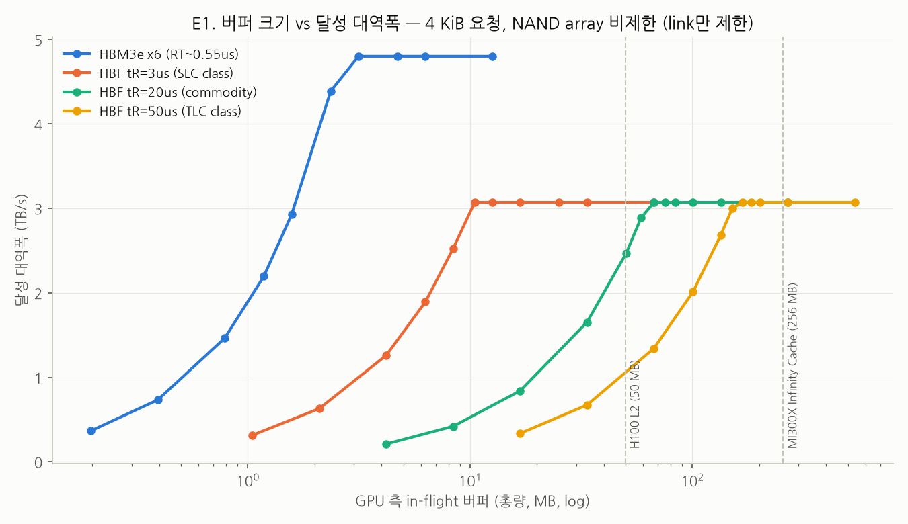
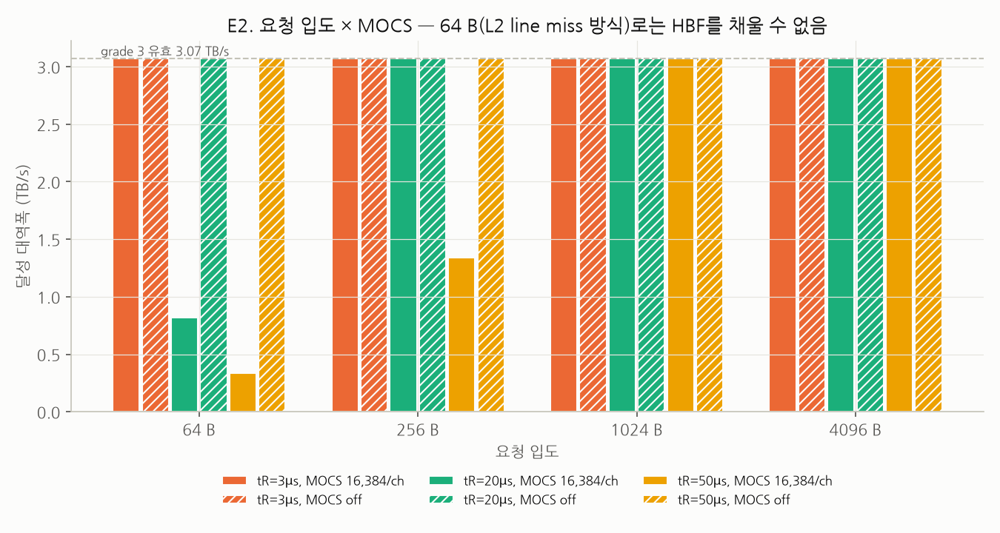
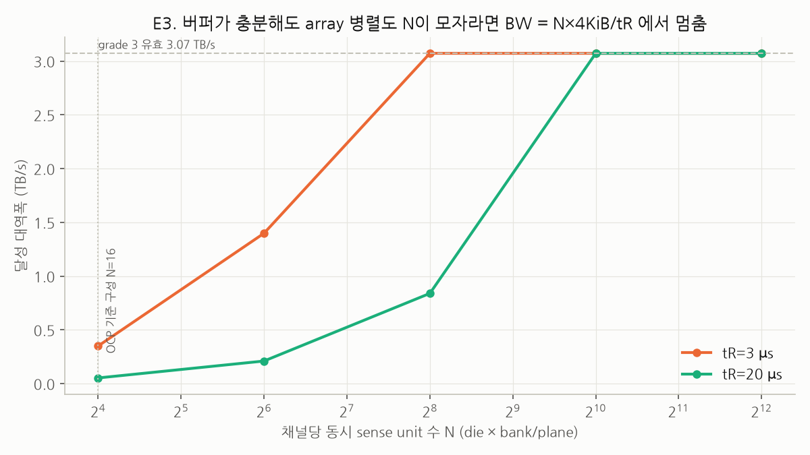

# GPU–HBF UCIe 직결 시 latency 은닉에 필요한 버퍼 — 실험 보고

> 대상: HBF(OCP v0.7.0, speed grade 3 = 3,072 GB/s 유효)가 GPU에 UCIe로 직결되어 near tier 또는
> weight 전용 tier로 쓰이는 경우. 비교 기준: GPU에 HBM3e 6 stack(4.8 TB/s)을 직결한 통상 구성.
> 코드·재현: `sim.py`, `run_experiments.py`. 원시 결과: `results/`.
> 라벨 규약은 OCP_CONSTRAINTS.md를 따른다 — [원문] 표준 축자 / [가정] 표준 부재 값 / [외부] GPU·HBM 공개 수치 / [해석] 분석자 유도.

---

## 0. 한 줄 결론

| | HBM3e ×6 (4.8 TB/s) | HBF 직결, SLC급 tR 3 µs | HBF 직결, commodity tR 20 µs | HBF 직결, TLC급 tR 50 µs |
|---|---|---|---|---|
| 유효 BW를 내기 위한 GPU 측 in-flight 버퍼 (시뮬 99% 도달) | **3.1 MB** | **10.5 MB** | **67 MB** | **168 MB** |
| H100 L2 50 MB 대비 [외부] | 6 % | 21 % | 134 % | 336 % |
| 필요 outstanding 요청 수 — 64 B(L2 line miss) 기준 | 41k | 158k | 974k | 2.4M |
| 필요 outstanding 요청 수 — 4 KiB burst 기준 | — | 2.5k | 15k | 38k |
| 64 B 요청으로 MOCS 16,384/ch 안에서 달성 가능한 BW | — | 3,072 GB/s | **818 GB/s** | **336 GB/s** |

**HBM 방식(L2 cache miss 처리)으로는 HBF를 채울 수 없다.** 바이트 용량으로는 SLC급 tR에서만 L2에
들어가고(그것도 L2의 1/5), commodity NAND면 L2 전체보다 크다. 그보다 먼저 **요청 개수**가 막힌다:
L2 miss 단위(64 B)로는 HBF 쪽 MOCS(최대 outstanding 명령 수 16,384)에 tR 20 µs부터 걸려 BW가
818 GB/s(27 %)에서 멈추고, GPU 쪽 miss 추적 엔트리도 HBM 대비 4–20배가 필요하다.
HBF는 **4 KiB burst read를 발행하는 전용 prefetch/DMA 엔진 + page 단위 landing buffer**로 구동해야 하며,
그 버퍼가 SLC급이면 ~10 MB, commodity NAND면 ~60–70 MB(2중 버퍼링 시 ×2)다.

---

## 1. 실험 설정

### 1.1 모델 (`sim.py`)

채널 단위 closed-loop 이산사건 시뮬레이션. HBF·HBM 모두 채널이 독립이므로(OCP §4.3 [원문]) cube/stack
결과 = 채널 결과 × 채널 수.

```
host --cmd(t_cmd)--> [bank별 page cache buffer 2×4 KiB | sense unit(tR), 같은 bank 직렬] --data pipe(192 GB/s/ch)--> host(t_resp)
     ↑ outstanding_bytes + req ≤ W 인 동안만 발행(버퍼 W = 실험 변수)
```

| 항목 | HBF | HBM3e | 근거 |
|---|---|---|---|
| 채널 수 × 유효 BW | 16 × 192 GB/s (256 raw × AXI 0.75) = 3,072 GB/s | 96 pseudo-ch × 50 GB/s = 4.8 TB/s | OCP Table 2 [원문] / H200급 [외부] |
| 접근 단위 | 64 B 요청, burst ≤ 4 KiB, page 4 KiB (DLU) | 64 B 요청, row 1 KiB | OCP §4.1 [원문] / [외부] |
| bank별 cache | 2 page (NCBB 기본) | open row 1 | OCP §5.3.1 [원문] / [외부] |
| sense 시간 | tR ∈ {3, 20, 50} µs (SLC / commodity / TLC) | tRCD+tRP ≈ 35 ns | **[가정]** 표준 부재 / [외부] |
| 고정 지연 | 링크 편도 0.15 µs ×2 + hit 0.3 µs | fabric 편도 0.25 µs ×2 + CAS 20 ns | **[가정]** |
| 최대 outstanding | MOCS 16,384 / 채널 | 무제한 | OCP MOCS CSR [원문], 채널당 적용은 [해석] |
| sense unit 수 N | 16(OCP 기준 구성) ~ 4,096 sweep | 16 bank | OCP §13.1.1 [원문] / [외부] |

워크로드: weight streaming — 순차 주소, 4 KiB 채널 인터리빙(OCP §13.3.1 [원문]). 소비자는 무한히 빠르다고
가정(데이터 도착 즉시 버퍼 슬롯 반환) → 결과는 **버퍼 하한**이다. 실제 landing buffer는 compute가 소비할 때까지
붙잡으므로 2중 버퍼링 기준 ×2 정도를 본다.

### 1.2 해석식

Little's law: `in-flight bytes = BW × latency`, `in-flight 요청 수 = in-flight bytes / 요청 크기`.
무부하 miss latency = t_cmd + tR + (요청 크기 / 채널 BW) + t_resp.

---

## 2. 결과

### E1. 버퍼 크기 vs 달성 대역폭 (4 KiB 요청, array 비제한)



| 장치 | 유효 BW 상한 | 무부하 miss latency | Little 추정 | 시뮬 95 % 도달 | 시뮬 99 % 도달 | H100 L2 50 MB 대비 (99 %) |
|---|---|---|---|---|---|---|
| HBM3e ×6 | 4.80 TB/s | 0.54 µs | 2.6 MB | 3.1 MB | 3.1 MB | 6 % |
| HBF tR 3 µs | 3.07 TB/s | 3.32 µs | 10.2 MB | 10.5 MB | 10.5 MB | 21 % |
| HBF tR 20 µs | 3.07 TB/s | 20.32 µs | 62.4 MB | 67.1 MB | 67.1 MB | 134 % |
| HBF tR 50 µs | 3.07 TB/s | 50.32 µs | 154.6 MB | 151.0 MB | 167.8 MB | 336 % |

- 시뮬 knee는 Little 추정의 1.0–1.1배. 버퍼가 knee 아래면 BW가 버퍼에 정비례(`BW = W / latency`)로 떨어진다.
- HBM 대비 HBF가 필요로 하는 버퍼는 **3.4배(SLC) / 22배(commodity) / 54배(TLC)**. BW는 HBM이 1.56배 높은데도 그렇다 —
  차이는 전적으로 latency 비(0.54 µs vs 3.3–50 µs)에서 온다.
- knee 위에서는 버퍼를 늘려도 BW는 그대로이고 latency만 늘어난다(버퍼 = 대기열). 예: tR 20 µs에서 16 MiB/ch로
  키우면 평균 latency 87 µs.

### E2. 요청 입도 × MOCS — "L2 cache line miss 방식"의 한계



버퍼는 충분히 준 상태(Little × 1.6)에서 요청 입도만 바꾼 결과.

| tR | 64 B | 256 B | 1 KiB | 4 KiB | 필요 outstanding (cube, 64 B / 4 KiB) |
|---|---|---|---|---|---|
| 3 µs | 3,072 GB/s | 3,072 | 3,072 | 3,072 | 158k / 2.5k |
| 20 µs | **818 GB/s** | 3,072 | 3,072 | 3,072 | 974k / 15k |
| 50 µs | **336 GB/s** | **1,342** | 3,072 | 3,072 | 2.4M / 38k |

(MOCS 제한을 끄면 모든 칸이 3,072 GB/s — 즉 위 병목은 순수히 outstanding **개수** 제한이다.)

- 64 B 단위로 HBF를 구동하면 채널당 outstanding이 MOCS 16,384에 닿아 `BW ≤ 16,384 × 64 B / latency`로 묶인다.
  tR 20 µs면 cube 818 GB/s, 50 µs면 336 GB/s. 이는 OCP_CONSTRAINTS §6의 "(ii) 은닉 실패 → BW 상한 = C_inflight / tR" 갈래가
  **표준 상수(MOCS)로 실제 발현**한 것이다.
- GPU 쪽도 마찬가지다. HBM 4.8 TB/s를 채우는 데 필요한 64 B outstanding miss는 41k(부하 시 75k)인데 [해석], HBF는
  SLC급에서도 158k, commodity면 974k다. GPU L2의 miss 추적(MSHR) 용량은 HBM 설계점에 맞춰져 있으므로
  [가정] 그 4–20배를 L2 miss 경로로 감당하는 것은 현실적이지 않다.
- **4 KiB burst(BCS 지원 제품)** 로 가면 필요 엔트리가 64분의 1로 줄어 모든 tR에서 링크 상한에 도달한다.
  단 tR 50 µs의 38k는 MOCS가 cube 총량 16,384로 해석될 경우 [해석] 다시 걸린다 → 채널당 MOCS 여부가 제품 확인 사항.

### E3. NAND array 병렬도 N — 버퍼로 풀리지 않는 상한



| tR | N = 16 (OCP 기준 구성) | 64 | 256 | 1,024 | 4,096 |
|---|---|---|---|---|---|
| 3 µs | 350 GB/s | 1,398 | **3,072** | 3,072 | 3,072 |
| 20 µs | 52 GB/s | 210 | 839 | **3,072** | 3,072 |

- `BW_array = N × 4 KiB / tR`. 버퍼를 아무리 줘도 이 위로 못 올라간다. 기준 구성(채널당 die 1 × bank 16)으로는
  링크의 1.7 %(tR 20)–11 %(tR 3)밖에 못 낸다 — 지식 문서 §15.1·OCP_CONSTRAINTS §10과 일치.
- 역으로, N이 모자라면 필요 버퍼도 작다(tR 20 µs·N 16: 1 MB). **버퍼 요구량은 `min(링크, array) BW × latency`**
  이므로 "버퍼 60 MB가 필요하다"는 진술은 "array가 3 TB/s를 낼 수 있다"는 전제(N ≥ 1,024/ch, tR 20 µs)를 깔고 있다.

### E4. tR 편차(jitter)

| tR 20 µs, jitter | 95 % 도달 | 99 % 도달 | p99 latency (버퍼 = Little × 1.0) |
|---|---|---|---|
| ±0 % | 62.4 MB | 62.4 MB | 20.3 µs |
| ±30 % | 62.4 MB | 68.6 MB | 26.5 µs |
| ±60 % | 62.4 MB | 68.6 MB | 32.4 µs |

편차는 99 % 도달 버퍼를 ~10 % 올린다. read-retry(ARUSER[8:6] 단계적 재발행 [원문])까지 포함하면 꼬리가 더 길어지므로
설계 마진으로 Little × 1.2–1.5를 잡는 것이 안전하다 [해석].

### E5. 시나리오별 요약 (해석식)

| 시나리오 | 유효 BW | latency | 필요 in-flight | 4 KiB 요청 | 64 B 요청 | H100 L2 대비 |
|---|---|---|---|---|---|---|
| 6×HBM3e | 4.8 TB/s | 0.55 µs | 2.6 MB | 645 | 41k | 5 % |
| 6×HBM3e, 부하 latency 1 µs | 4.8 TB/s | 1.0 µs | 4.8 MB | 1.2k | 75k | 10 % |
| HBF grade 3 직결, tR 3 µs | 3.07 TB/s | 3.3 µs | 10.1 MB | 2.5k | 158k | 20 % |
| HBF grade 3 직결, tR 20 µs | 3.07 TB/s | 20.3 µs | 62.4 MB | 15k | 974k | 125 % |
| HBF grade 3 직결, tR 50 µs | 3.07 TB/s | 50.3 µs | 154.5 MB | 38k | 2.4M | 309 % |
| **통로 반분**: HBF grade 2, tR 20 µs | 1.54 TB/s | 20.3 µs | 31.2 MB | 7.6k | 487k | 62 % |
| **통로 반분**: HBF grade 2, tR 3 µs | 1.54 TB/s | 3.3 µs | 5.1 MB | 1.2k | 79k | 10 % |
| HBF grade 1, tR 20 µs | 0.38 TB/s | 20.3 µs | 7.8 MB | 1.9k | 122k | 16 % |

---

## 3. 해석 — "HBM처럼 L2에 담아서 처리할 수 있는가?"

**아니오, 두 가지 이유에서.**

1. **개수의 벽이 바이트의 벽보다 먼저 온다.** L2 miss 경로는 64–128 B 단위다. 그 입도로 HBF를 유효 BW로
   돌리려면 (a) 디바이스 MOCS 16,384/ch를 tR ≥ 20 µs에서 초과하고(E2), (b) GPU 쪽 miss 추적 엔트리가 HBM 설계점의
   4–20배 필요하다. 버퍼 바이트가 충분해도 BW가 818 GB/s(tR 20)/336 GB/s(tR 50)에 묶인다.
2. **바이트도 commodity NAND면 L2를 넘는다.** 62–67 MB(2중 버퍼링 시 ~130 MB)는 H100 L2 50 MB보다 크고,
   SLC급(10 MB)이어도 L2의 1/5을 activation·KV working set에서 떼어 와야 한다.

HBM이 L2 miss 처리만으로 되는 이유는 latency 0.5–1 µs × 4.8 TB/s = 2.6–4.8 MB, 41–75k 엔트리가
GPU가 원래 그 점에 맞춰 설계된 범위라서다. HBF는 같은 BW급에서 latency가 6–100배이므로 같은 메커니즘이 성립하지 않는다.

**직결 HBF가 성립하려면 (설계 요건):**

| 요건 | 값 | 근거 |
|---|---|---|
| 접근 입도 | 4 KiB burst read (BUCCAP.BCS 지원 제품) + batch read hint | E2; OCP §5.3.1·§5.3.2 [원문] |
| 발행 주체 | L2 demand miss가 아닌 **전용 prefetch/DMA 엔진**(host-managed, §13.3.2 [원문]) | E2 |
| landing buffer | SLC급 10–20 MB / commodity 65–130 MB (2중 버퍼링 포함), SRAM 또는 page 단위 L2 partition | E1, E4 |
| outstanding 엔트리 | 4 KiB 단위 2.5k(SLC) / 15k(commodity) / 38k(TLC); 채널당 MOCS 여부 확인 | E2 |
| array 병렬도 | N ≥ 256/ch (tR 3) 또는 ≥ 1,024/ch (tR 20) — 없으면 버퍼 논의 자체가 무의미 | E3 |

**아키텍처 비교 관점 [해석]:**
- *통로 반분(3 HBM + HBF grade 2)*: HBF 쪽 버퍼 요구가 절반(31 MB@tR 20)으로 줄지만 여전히 L2 급이며, 개수 문제는 그대로다.
- *Daisy chain(GPU–HBM–HBF)*: landing buffer가 HBM(수십 GB)으로 옮겨가 버퍼 크기·개수 문제가 사라진다. 대신
  HBF에서 읽은 바이트마다 HBM write + read가 추가되어 **HBM 대역폭을 2배로 소모**한다(3 TB/s weight stream → HBM
  6 TB/s 트래픽). 즉 직결은 "on-die 버퍼 수십 MB"를, daisy chain은 "HBM BW 2배"를 지불한다. 이 trade-off가
  최적 아키텍처 비교의 핵심 축 중 하나다.

---

## 4. 한계 (미모델)

- tR·링크 지연·hit 지연은 표준 부재 → [가정] 브래킷. SLC 전제(TLC면 page별 tR 편차 추가).
- 소비자 무한 속도 → 버퍼 **하한**. 실제 compute 소비 지연·2중 버퍼링은 ×2 수준으로 보정.
- GPU NoC·L2 slice 큐잉, MSHR 수치는 비공개라 모델에 없음(정성적 [가정]).
- MOCS를 채널당으로 해석. cube 총량이면 E2의 4 KiB 결과도 tR 20 µs부터 제한됨.
- HBM 모델은 단순화(row hit 위주 순차 stream). refresh·read-disturb·write 트래픽 간섭 미모델.
- 순차 weight stream만. KV/random 64 B 접근은 page cache hit율이 낮아 E2보다 더 불리.
